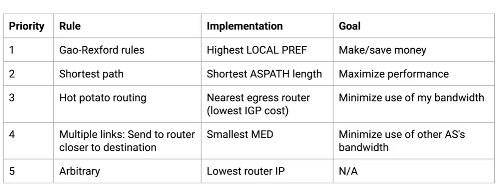
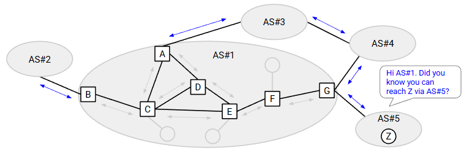
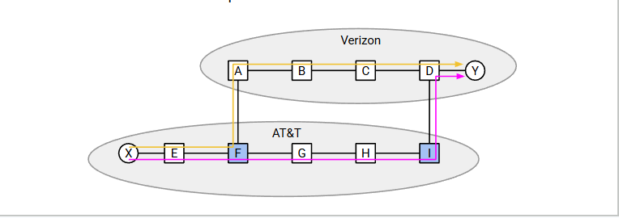
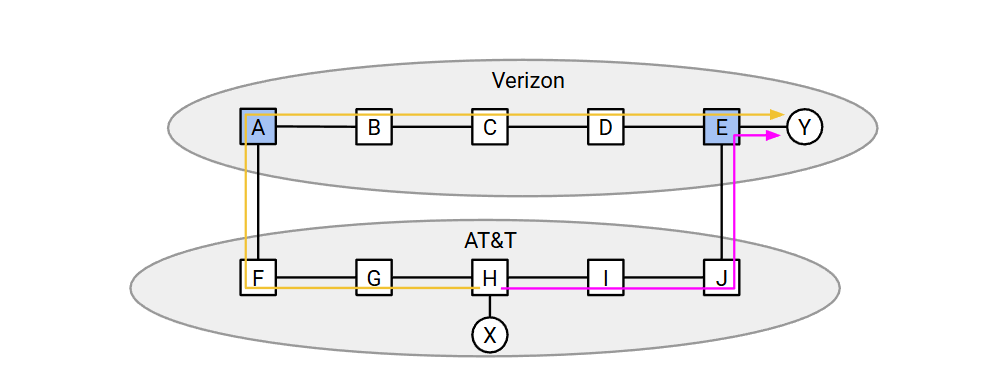

# Inter-Domain topology

与 intra-Domain 不同的是
Inter-Domain 并不以最短路径或者是 min cost 作为 routing 的基准 接下来介绍现实世界中的 Inter-Domain topology
前面介绍了 Intra-Domain 的模型 划归

## Autonomous Systems

aka AS 
 Intra-Domain 的最小单位

### AS graph 

依然类似于之前在制定 protocal 时的rule
no cycles
    这一点要结合后面的 Gao-Rexford Rules

### type

1. Stub AS
    kind of like end host
2. Transit AS 
    router

### relationship

1. Provider and Customer
    Customers pay providers.
2. Peer
    通过等量的资源交换建立的关系

## Gao-Rexford Rules

1. Making money is good
2. Don't do work for free

Prefer the most porfitable path
与 intra-domain 最大的不同就是这里 
For example: 就像前面说过的金融机构并不在意单拉线路所带来的cost 换句话说 对于单拉线路所带来的收益远大于cost 
因此并不一定是最短的费用最低的线路会是最好的 
要根据自身的需求来制定相应的策略

## BGP

Border Gateway Protocol

If a stub AS is connected to a single provider, it doesn't need to run BGP.


## Importing and Exporting

按照 GR rules 我们将按照 customer > peer > provider 的顺序转发



### Exporting

使用Gao-Rexford规则决定哪些自治系统（AS）能收到该路由信息。
在通告中需包含MED值（路由器到目的地的距离）。
MED值越低=优先使用该路由器。

### Importing 导入规则（按优先级排序）：

1. 采用Gao-Rexford规则（客户>对等节点>供应商）
目标：节省成本
在处理的时候 可以采用负权的方式 用 Bellman-Ford 
2. 若第1条平局：选择路径更短的路径（经过更少自治系统的路径）
目标：最大化性能
3. 若第1-2条平局：选择出口路由器最近的路径（热土豆路由）
目标：最小化本网络带宽占用
4. 若第1-3条平局：选择MED值较低的路径
5. 若第1-4条平局：任意决胜方式（例如选择IP地址较小的路由器）

## aggregate and Path-Vector

### aggregate

就像之前的 protocal 
BGP can aggregate multiple entries into one, combining ranges into one larger range.

#### multi-homing

An AS having multiple providers.

结合之前的 GR Rules 

Verizon 将会有一条关于 UCB 的额外的条目在 table 中 因为 UCB 付费给 Verizon

### Path-Vector

#### problem

1. 因为引入了偏好 所以这里可能会有 loops 

> a said I prefer b
> b said I prefer a


2. 还是因为引入了偏好 有可能要走一条我不想走的路

> a said I never pass through AS#2019
> a got a announcement: I am AS#20, I can reach D and cost 10
> But a doesn't know does it through AS#2019. So dose a shoule creat the connnect?

#### Solve

Instead of Distance-Vector, we will use Path-Vector.

Instead of advertising distance to destination, advertise the whole AS path.
Example: "I am A, and I have a path to D via A → B → C → D."


# BGP Implementation

BGP 是 route protocal 的一部分
处理的是 how to routing


注意不要混淆命名

## External BGP and Internal BGP

1. Inter-Domain 域间
   1. eBGP
    External BGP
    Routers in different ASes exchanging routes.
    AS#1 said to AS#2: Hey! I have a way to Z
   2. iBGP
    Internal BGP
    Routers distributing externally-learned routers to interior routers.
    The border router said to interior routers: Hey! I know how to get Z
2. Intra-Domain 域内
    Intra-Domain gataway protocal
    虽然这里
    在 AS 内部之间的routing 使用 IGP




### border router 

At least one link to a router in a different AS

They also be called BGP speackers

#### egress router

对于一个特定的 AS 之外的 目的地来说 要经过的 border router 被称作 egress router

### interior router

Only linked to other router in the same AS

### how to work

1. Use IGP to learn internal routes to others in the AS.
2. Use eBGP to learn external routes to other ASes.
3. Use iBGP to distribute external routes to others in the AS.

#### Send packet to different ASes

Every router has two routing tables
1. IGP table
2. BGP table

1. Use the BGP table to find the egress router
2. Use the IGP table to find the next-hop to the egress

## Multiple Links Between ASes

### If there are multiple links between two links, which one you will choose?



#### IGP converge

#### eBGP 

   1. F 将会知道与其相连的 A 可以到达 Verizon
   2. 同样的 I 将会知道 D 可以到达 Verizon

#### iBGP

   1. F I 将会向 AT&T 内的router 声明他们俩可以到达 Verizon
   2. 要选择哪一个呢？
      1. Reacall: Gao-Rexford Rules
         1. Making money is good
         2. Don't do work for free
         3. customer > peer > provider.
      2. 这二者是 peer 的 也就是说 Gao-Rexford Rules 并不起作用
      3. Hot potato routing: Get rid of the packet ASAP, and make someone else carry it the rest of the way.So we will choose the gold one. 
      But if  
      和之前的 best effort 相呼应 这里也尽快转发
      
      但是如果在 AS 之内的路径也是相同的怎么办？
      
      
      4. 之前在域内路由中不会有这样的问题 因为是Distance Vector
      而现在是 Path Vector 我们并不能够按照 min cost 的策略选择路径
      但是域内路由是可以选择的 是按照最小化 cost 的策略的
      所以将选择权交给将要转发的 Verizon
      也就是说由 Verizon 判断 which one will be egress router
      特别的 When announcing routes, include a Multi-Exit Discriminator (MED).
      > MED represents distance from router to destination. Lower number is preferred.
      域间路由是存储了 distance 的，这里复用 distance

总结放在上面的 Exporting Importing Rules

## Message Types and Route Attributes

```cpp
class BGP {
public:
    // destination and list of all ASes in this route, in reverse order
    pair<string, list<string>> ASPATH;
    // lowwer is better
    int MED;
};

class iBGP : public BGP {
private:
    // higher is better
    int LOCAL_RREFERENCE;
};
```
