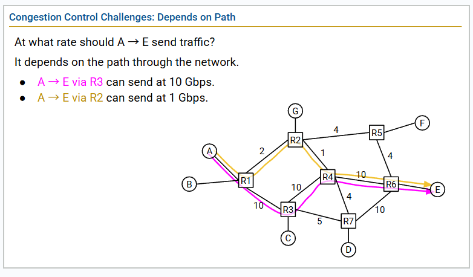
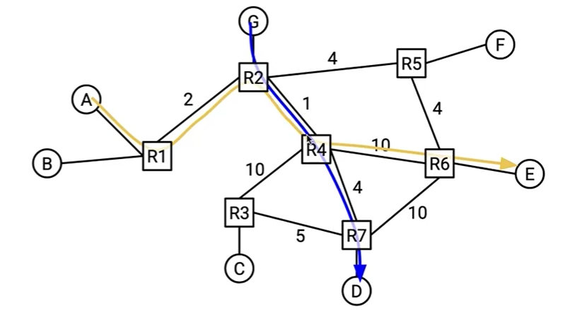
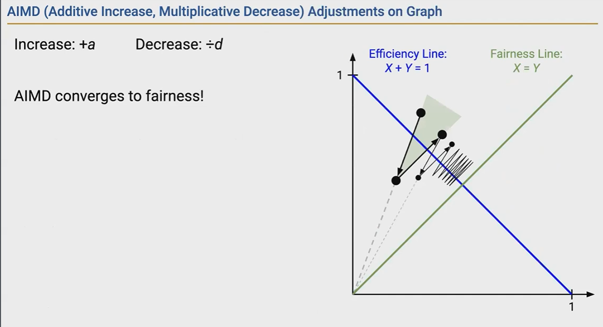

# Principles

## Why is it hard?



通过对 两个出 的比较 
这里不需要担心后面的是否会更大 
因为 bottomneck 是最小的 bandwidth 如果这里都更小了 那么后面的再大也没有用

## Possible Approaches

### reservation

reserve the bandwidth

### Pricing

more money, more traffic

### Dynamic adjustment

Learn the current congestion level, and adjust your rate accordingly.
Everyone slow down.
Requires good citizenship (no cheating).

# Dynamic Adjustment

## Algroithm

### Problem

1. router join and tear down

2. two path use the same link


### two inspective to solve

1. Host-based

2. Router-addisted

### Host-based

Implemented at the end hosts. No special support from routers.

1. Pick an initial rate R.
2. while (sending packet) {
    Try send at rate R for some period of time (another TTL)
    Congestion ? R -= n : R += n; // n is a trick number
}

So the first problem is how do you detect congestion?

#### Detect Congestion

2 way

##### Loss-based

If we lose a packet, declare congestion.

1. How to handle the lost packet?
    TCP will handle it.(dup ack, timer expires)
2. Not all loss is caused by congestion.

3. A little bit slow, when we detect loss, the network is already congested.

##### Dealy-based

It's hard to define delay.

RoundTrip Time

The path is changing, the links are changing.

#### Pick an initial rate

binary-search

1. Starts with a small rate
2. Increase exponentially(double rate each time) until we detect loss.

## Reacting to Congestion (AIMD)

### Sending too fast

1. lost packet
2. congestion
3. query are full

### Sending slow

1. waste the bandwidth

trade-off

Additive Increase Multiplicative Decrease

其他方法 不能保证 fairness
AIMD 会缩小两者之间的距离 达到"收敛"的效果

增加是不会改变之间的差值
但是减少会改变差值 (Multiplicative will change the $(Y - X)$)

$$0.5 * Y - 0.5 * X = 0.5 * (Y - X)$$



## Implementing Congestion Control with Event-Driven Updates

### CWND

RECALL: 
1. Window is the packets' number in the flight.

2. We change the rate(resize the window) after period of time.

The rate we send the pakcet is the size of the window

**period of time** 
It's hard to measure the RTT. So we will not hard code the RTT. Instead, we will change the rate when we receive the acks.

### SSTHRESH

last safe rate


# Congestion Contral Implementation

## Fast Recovery

Keep host busy

## State Maching and Variants


```cpp
if (timer expires) {
    ssthresh = CWND / 2;
    CWND = 1;
    dup = 0;
    timer.reset();
    resend_lost_packet();
}

if (acks_number > last_number) {
    last_number = acks_number;
    dup = 0;
    timer.reset();

    if (packet_in_flight_number < CWND) {
        send_packet();
    }

    if (in_fast_recovery) {
        CWMD = ssthresh;
        dup = 0;
        in_fast_recovery = false;
    } else {
        if (CWND < ssthresh) {
            CWND += 1; 
            // For everey acks arrive, we add 1. It means double the rate.
        } else {
            CWND += 1 / CWND;
        }
    }
} else {
    // acks_number == last_number
    dup++;

    if (dup == 3) {
        ssthresh = CWND / 2;
        CWND = CWND / 2 + 3;
        resends_lost_packet();
        in_fast_recovery = true;
    } else if (dup > 3 && in_fast_recovery) {
        CWND = ssthresh + dup;
    }
}

```

# Congestion Control Issues

Confusing corruption and congestion.

Short connections complete before discovering available capacity.

Router queues get filled up, causing high delays.

Cheating.

Congestion control and reliability are intertwined.

# Router-Assisted Congestion Control

## Fair 

蜻蜓队长

## ECN

(Explicit Congestion Notification) bit

提前告知 congestion

比如设定一个阈值 当队列中的packet 达到70% 那就可以说将要拥塞

