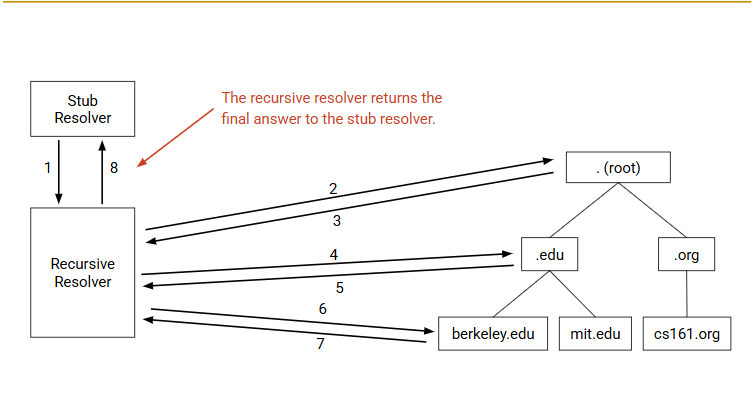

# DNS

Domain Name System

DNS can store and serve domain-to-IP mappings.

## What is DNS For?

Map the ip address and the website

1. lightweight fast

2. scable

3. aviliable
every machine 24 * 7

## Design

Always start at root.



### Stub Resolver

Stub Resolver is on your computer

### Recursive Resolver

1. ISP
2. application providers(Cloudflare 1.1.1.1 Google 8.8.8.8)

The recursive resolver build a larger cache from multiple users' requests.

Reduce load on name servers

## Implementation

UDP 

RECALL:
UDP and TCP both contains the checksum.
We do check the packet wether correct or not.
But UDP doesn't take responsible for reloading or something else.

### UDP header

```cpp
class UDP {
    Souce Port;
    const int Destination Port = 53;
    Checksum;
    Length;
};

class DNS {
    ID number; // security 
    Flags; 
    Question count;
    Answer count;
    Authority count;
    Additional count;

    Question Records; // 问题
    Answer Records; // 回答
    Authority records; // 下一步找谁？
    Additional Records; // 具体地址
};
```

Use this command, 向根服务器（198.41.0.4）直接发起非递归查询的完整 DNS 。

```shell
dig +norecurse eecs.berkely.edu @198.41.0.4
```

```shell
➜  notes git:(main) ✗ dig +norecurse eecs.berkeley.edu @198.41.0.4
;; BADCOOKIE, retrying.
;; BADCOOKIE, retrying in TCP mode.

; <<>> DiG 9.18.39-0ubuntu0.24.04.2-Ubuntu <<>> +norecurse eecs.berkeley.edu @198.41.0.4
;; global options: +cmd
;; Got answer:
;; ->>HEADER<<- opcode: QUERY, status: NOERROR, id: 36042
;; flags: qr; QUERY: 1, ANSWER: 0, AUTHORITY: 13, ADDITIONAL: 27

;; OPT PSEUDOSECTION:
; EDNS: version: 0, flags:; udp: 1472
;; QUESTION SECTION:
;eecs.berkeley.edu.             IN      A

;; AUTHORITY SECTION:
edu.                    172800  IN      NS      a.edu-servers.net.
edu.                    172800  IN      NS      b.edu-servers.net.
edu.                    172800  IN      NS      c.edu-servers.net.
edu.                    172800  IN      NS      d.edu-servers.net.
edu.                    172800  IN      NS      e.edu-servers.net.
edu.                    172800  IN      NS      f.edu-servers.net.
edu.                    172800  IN      NS      g.edu-servers.net.
edu.                    172800  IN      NS      h.edu-servers.net.
edu.                    172800  IN      NS      i.edu-servers.net.
edu.                    172800  IN      NS      j.edu-servers.net.
edu.                    172800  IN      NS      k.edu-servers.net.
edu.                    172800  IN      NS      l.edu-servers.net.
edu.                    172800  IN      NS      m.edu-servers.net.

;; ADDITIONAL SECTION:
a.edu-servers.net.      172800  IN      A       192.5.6.30
b.edu-servers.net.      172800  IN      A       192.33.14.30
c.edu-servers.net.      172800  IN      A       192.26.92.30
d.edu-servers.net.      172800  IN      A       192.31.80.30
e.edu-servers.net.      172800  IN      A       192.12.94.30
f.edu-servers.net.      172800  IN      A       192.35.51.30
g.edu-servers.net.      172800  IN      A       192.42.93.30
h.edu-servers.net.      172800  IN      A       192.54.112.30
i.edu-servers.net.      172800  IN      A       192.43.172.30
j.edu-servers.net.      172800  IN      A       192.48.79.30
k.edu-servers.net.      172800  IN      A       192.52.178.30
l.edu-servers.net.      172800  IN      A       192.41.162.30
m.edu-servers.net.      172800  IN      A       192.55.83.30
a.edu-servers.net.      172800  IN      AAAA    2001:503:a83e::2:30
b.edu-servers.net.      172800  IN      AAAA    2001:503:231d::2:30
c.edu-servers.net.      172800  IN      AAAA    2001:503:83eb::30
d.edu-servers.net.      172800  IN      AAAA    2001:500:856e::30
e.edu-servers.net.      172800  IN      AAAA    2001:502:1ca1::30
f.edu-servers.net.      172800  IN      AAAA    2001:503:d414::30
g.edu-servers.net.      172800  IN      AAAA    2001:503:eea3::30
h.edu-servers.net.      172800  IN      AAAA    2001:502:8cc::30
i.edu-servers.net.      172800  IN      AAAA    2001:503:39c1::30
j.edu-servers.net.      172800  IN      AAAA    2001:502:7094::30
k.edu-servers.net.      172800  IN      AAAA    2001:503:d2d::30
l.edu-servers.net.      172800  IN      AAAA    2001:500:d937::30
m.edu-servers.net.      172800  IN      AAAA    2001:501:b1f9::30

;; Query time: 31 msec
;; SERVER: 198.41.0.4#53(198.41.0.4) (TCP)
;; WHEN: Thu Nov 20 22:12:18 CST 2025
;; MSG SIZE  rcvd: 841

```

## Scaling

### Zones (Authority)

### Top-Level-Domain

### anycast

Serval servers use same IP address.

check whick root server I am using

```shell
➜  ~ dig +short +norec @k.root-servers.net hostname.bind chaos txt
"ns1.cn-ggz.k.ripe.net"
```

## Other Uses

### Email

### Load-Balacing

Same URL / different IP address

