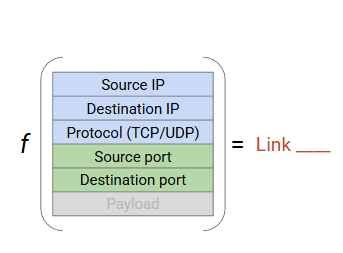
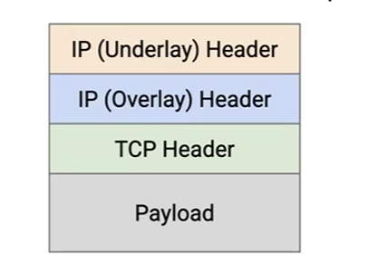

# Datacenter Routing

RECALL:
We use BGP to in the realworld. 

But the datacenter are 高度规则的 是接近于理想状态的
与 BGP 之间的区别主要在于平权路径的选择
BGP 在平权路径中只会选择一条

但是 datacenter 不同 在高输入输出的情况中 同时使用平权路径可以带来非常大的提升

## ECMP

(Equal Cost Multi-Path)

How to load balance?

### Round-Robin

TCP packet reording

### Destination-Based

sending to the same destination

### Source-Based

same source is sending to lots of destinations

### IP-based

multiple large flows between the same two servers

### Flow-Based

  
将 5 个值同时带入计算 (hash or something else...) 这样会得到一个独特的值 被包含为一个流 同一个流中的所有数据包使用同一条链路

避免乱序

### Multi-Path Distance-Vector Protocols

### Multi-Path Link-State Protocols

Each destination can have multiple entries

# Datacenter Addressing

hierarchical addressing

树的结构很好 虽然数量按指数级别增长 可是复杂度可以按对数级别增长

# Virtualization and Encapsulation

## Virtualization

virtual machine

## Overlay and Underlay Networks

underlay network physical addresses

overlay network organizational

virtual switch contains a map table(virtual address --> physical address)

## Multi-Tenancy and Private Networks

Use encapsulation again!

Each tenant has a virtual network ID for its own VMs.
