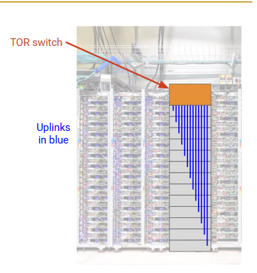
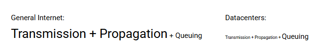

# Designing Datacenters

## What is a Datacenter?

internal traffic (east-west traffic)

## Inside a Real Datacenter

### Peering locations

### location

1. Cooling
2. Power
3. Pyhsal 

### racks

Inside a datacenter, servers are organized in physical racks.

**top-of-rack(TOR)** and **Uplink**
 

## Bisection Bandwidth

### How to compute the Bisection Bandwidth?

1. Delete the minium number of links necessary until the network is partitioned into two halves.

2. Partition the network 

### Full bisection bandwidth

All **hosts** (not include the routers) in one partition(the partition is defined by yourself. In another words, 是图中可分割的部分中的最大的速率) can send at full rate

notes: 

### Oversubscription

$$
\frac{full\; bisection\; bandwidth}{actual\; bisection\; bandwidth}
$$

RECALL:
为了保证数据包的完整性 必须要用链路中最小的发送速率 此时的发送速率才是 actual bisection bandwidth

## Topologies(Clos Networks)

Bandwidth 由 actual bisection bandwidth 制约 如何做到最大 bandwidth

### Problem 1 Big Switching

1. High switching speed needed
2. Large radix

**Solution**: Tree (oversubscription)

Fat Tree (not scalable 太集中)

commodity switches 

Fat Tree Clos Network (入 == 出 这样就解决了 oversubscription 的问题)

# Congestion Control in Datacenters

Problem we have

RECALL:
TCP sends packets as fast as it can.
TCP reacts only when it detects packet loss, which is already too late.

And because queuing is the biggest problem in datacenters, this makes things even worse.

## BBR

detect the delay

## DCTCP

RECALL:
[ECN](Congestion-Control.md#ECN)

Implement ECN

## pFabric

Give mice a way to skip to the front of the queue

Packets carry a single priority number in the header.
Priority = remaining flow size (number of unacknowledged bytes).
Lower number = higher priority.

// TODO 最小堆？
