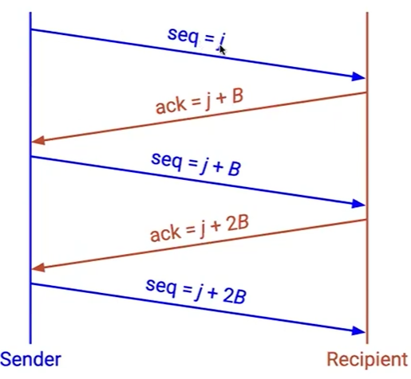
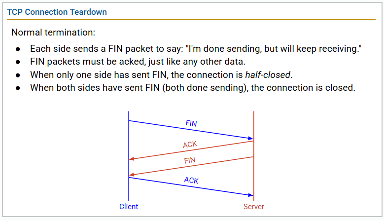
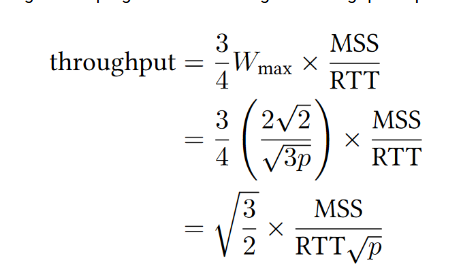

# Implementing TCP

## Byte Notation (Segments, Sequence Numbers)

### TCP Sequence Numbers

Numbering starts at a randomly-generated Initial Sequence Number (ISN).

什么也没有改变 只是序号改变 不从 0 开始

#### packet to bytes

## Maintaining State (Full duplex, Connection Setup and Teardown)

### maintain state

Keep track of packets' state.

#### Sender

1. Which packets have been sent and not acked
2. How much longer on the timer before I resend a packet

#### Receiver

Buffer the out-of-order packets

### Full duplex

双向独立

### Three-Way Handshake

### Teardown

 
### Piggybacking

Send the ack with the data.

#### application
In the application, it can be tricky.

1. TCP is implemented in the OS. OS doesn't know when application will have more data.
2. Application isn't thinking about packets and acks.

OS and Applicaton is separate

#### Three-Way Handling

SYN-ACK Service send the ack and SYN together.

1. Not tricky, because OS is doing the handshake, not the application.
2. Don't need to wait.

## Sliding Window

### Detecting Loss
 
Keep a single timer. If the timer expires, resend.

## Header

# TCP Throughput Model

$$ Throughput = \frac{3}{4} \times W_{max} \times \frac{MSS}{RTT} $$

And what does the $ W_{max} $ represent?

RECALL:
p the packet loss rate.

$$ total_packet = rate \times time = (\frac{3}{4} \times W_{max}) \times 0.5 \times W_{max} = \frac{3}{8} \times W_{max}^{2} $$

we just lose one packet, So 

$$ p = \frac{8}{3W_{max}^{2}} $$

## choppy

Solution: Equation-based congestion control.

