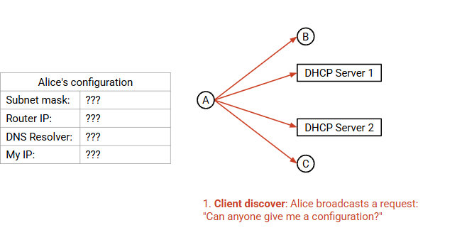
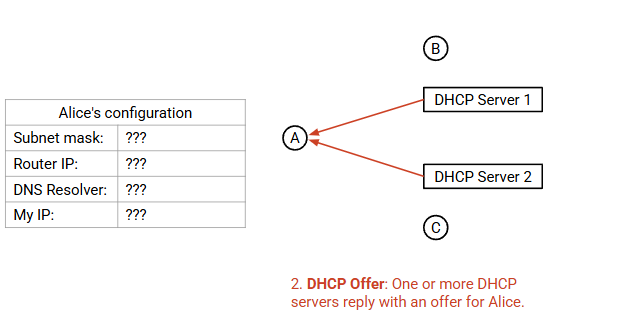
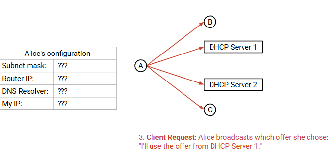
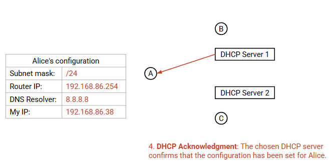
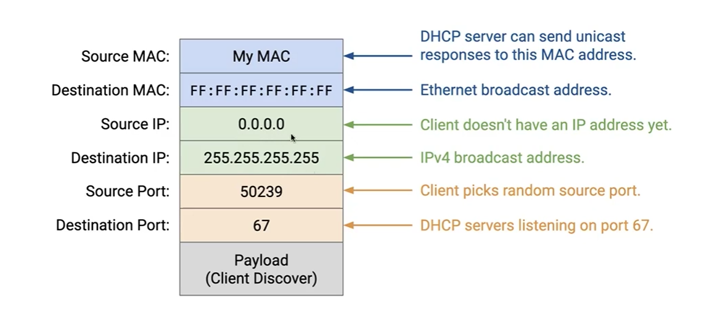
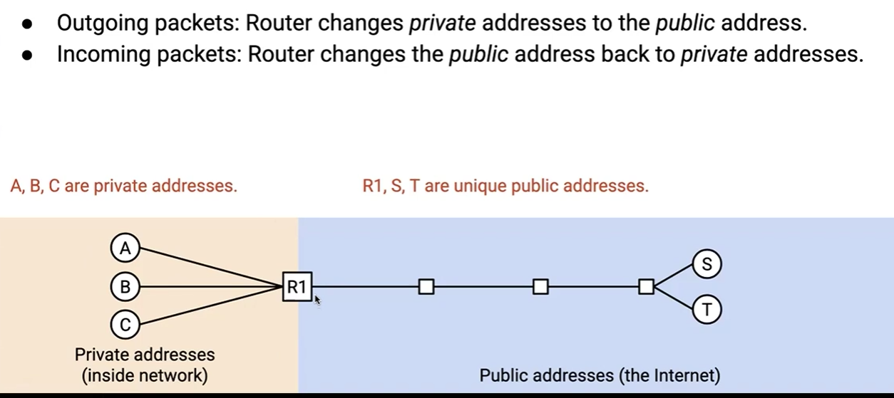

# ARP: Connecting Layers 2 and 3

How do you know the next hop's MAC address?

## Broadcast the question

If Alice wants to know Bob's MAC address. Alice will check the cache.

If Bob's MAC address is not in cache, Alice will broadcast the question.

If Bob is in the local network, then Bob will unicast its MAC address to Alice.

If Bob is not in the local network, the router will answer:" Bob was not in the local network. And this is my MAC address you should use to send packets to Bob"

## Prev "direct"

direct means in the same local network

## Neighbor Discovery in IPv6

Instead of broadcasting requests, multicast request to the group that Bob in.

Everyone joins a group based on their IPv6 address.

# DHCP (Dynamic Host Configuration Protocol) Joining a New Network

Private IP address 

## Need to learn

Subnet mask (who are my neighbors)

Default gateway (Where is the router)

DNS server 

IP address (we can use for this network)

四步走

## Imeplement Protocol

hierachical addressing

## Autoconfiguration in IPv6

### Use Neightbor Discovery to learn the other information

### Use SLAAC(Stateless Address Autoconfiguration) to give yourself a unique IPv6 address

MAC address is unique

Network ID(Neighbot Discovery (Hierarchical Addressing)) + Host ID(MAC address)

# NAT (Network Address Translation)

IPv4 address is not enough

## Basic NAT

Use a single public IP address to represent many hosts in the local network.

## NAT with Ports

但是如果左边的两个向右边的同一个 host 发送packet table应该怎么写？

Keep track of port numbers in the table.

## Rewriting Ports

Use the same inside port?

The router can rewrite the inside port.
就是由 router 分配 port (类似于 DHCP server)

## Implementing NAT

1. Rewrite headers
2. Read(or rewrite) the Layer 4 header (TCP UDP)
3. Maintaion a connection state table

### Inbound Connections

Outside hosts send packet to the inside hosts.
因为 router 是 public address 如果想要发给内部的某一个 host 怎么办?

Unluckly, NAT disallows inbound connections by default.

On the other hand, NAT helps preserve client privacy. Routers will not allow outside packets to be sent to you when there is no existing connection.

# TLS: Secure Bytestreams

run Layer 4.5

## TLS Handshake

// TODO
starts with a handshake 
- Exchanges secret keys
- Verifies identity of the serve

runs over TCP(dont concern about lost packet)

$$PMS = gab mod p$$

# End-to-End Walkthrough

When you open your PC and click a website

## 1. DHCP

## 2. ARP

## 3. DNS Lookup

## 4. Connect to Website

